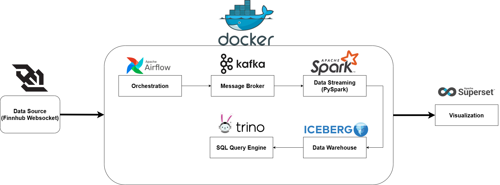
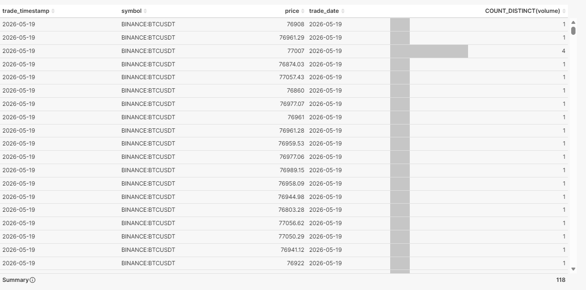
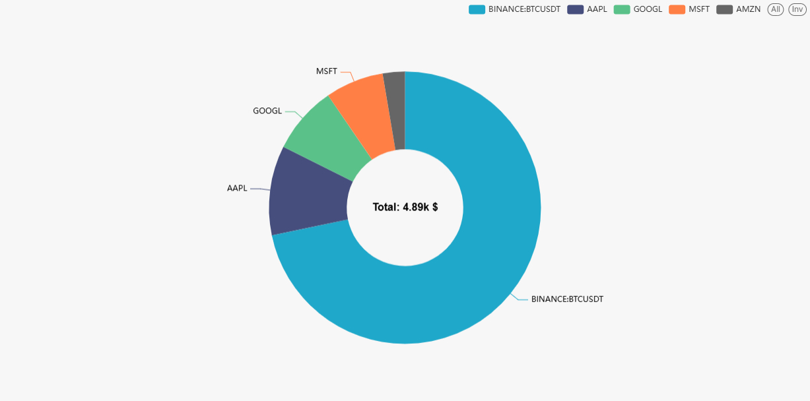
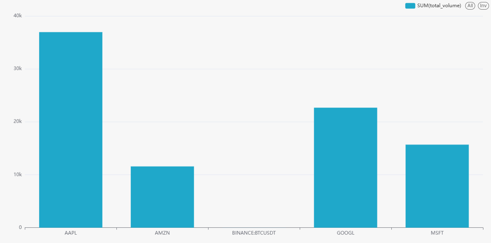

# Real-time Stock Data Streaming Pipeline

## Overview
This project implements a near-production stock trade streaming pipeline.

It ingests real-time trade events from the Finnhub WebSocket API, publishes them to Kafka, processes them with PySpark Structured Streaming, stores curated datasets in Apache Iceberg, serves analytical queries through Trino, and visualizes the results in Superset. Airflow is used for orchestration, while the Python codebase follows a Clean Architecture layout.
It ingests real-time trade events from the Finnhub WebSocket API, publishes them to Kafka, processes them with PySpark Structured Streaming, stores curated datasets in Apache Iceberg, serves analytical queries through Trino, and visualizes the results in Superset. Airflow is used for orchestration, while the Python codebase follows a Clean Architecture layout.

## Architecture



Primary flow:

`Finnhub -> stock-producer -> Kafka -> spark-streaming-job -> Iceberg -> Trino -> Superset`

Supporting services:

- `Hive Metastore` stores Iceberg metadata.
- `Postgres` backs the `metastore`, `airflow`, and `superset` databases.
- `Airflow` bootstraps and operates the producer and Spark streaming job.
- `Airflow` bootstraps and operates the producer and Spark streaming job.

## Project Structure
```text
.
|-- application/
|-- domain/
|-- infrastructure/
|   |-- finnhub/
|   |-- iceberg/
|   |-- kafka/
|   `-- spark/
|-- interfaces/
|   `-- airflow/
|-- shared/
|   |-- config/
|   `-- logging/
|-- scripts/
|-- tests/
|-- docker/
|-- docker-compose.yaml
|-- .env.example
`-- README.md
```

## Clean Architecture Mapping
- `domain/`: core trade entities and business rules.
- `application/`: orchestration logic built on top of domain use cases.
- `infrastructure/`: concrete adapters for Finnhub, Kafka, Spark, Iceberg, and related runtime concerns.
- `interfaces/airflow/`: Airflow DAGs used to operate the pipeline.
- `shared/`: shared configuration and logging utilities.

## Main Components

### 1. Ingestion Service
- Connects to `wss://ws.finnhub.io`
- Subscribes to symbols from `STOCK_SYMBOLS`
- Parses incoming payloads into `TradeEvent`
- Validates domain rules before publishing
- Produces to Kafka with retries and delivery callbacks
- Logs connection, subscription, delivery, and reconnection events

### 2. Spark Streaming Job
- Reads from Kafka with Structured Streaming
- Parses a fixed JSON schema
- Cleans and validates records
- Drops invalid rows for required fields
- Filters `price > 0`
- Filters `volume >= 0`
- Converts the event time into Spark `timestamp`
- Deduplicates by `symbol + trade_timestamp`
- Applies a configurable watermark
- Produces 1-minute aggregated metrics
- Writes both raw and aggregated streams to Iceberg with separate checkpoints

### 3. Iceberg, Hive Metastore, and Trino
- Spark catalog: `stock_catalog`
- Default namespace: `stock`
- Hive Metastore URI: `thrift://hive-metastore:9083`
- Trino catalog: `iceberg`
- Shared warehouse path: `/data/warehouse`

Tables created by the streaming job:

- `stock_catalog.stock.raw_stream_data`
- `stock_catalog.stock.aggregated_data`

Table layout:

- Raw table partitioning: `days(trade_timestamp), symbol`
- Aggregated table partitioning: `days(window_start), symbol`

### 4. Airflow Orchestration
Available DAGs:

- `stock_pipeline_start`
- `stock_pipeline_monitor`
- `stock_pipeline_stop`

Typical responsibilities:

- verify service dependencies
- bootstrap the Kafka topic
- bootstrap the Iceberg namespace and tables
- start the Spark streaming container
- start the producer container
- run periodic health checks

## Environment Variables
Copy the example file first:

```bash
cp .env.example .env
```

Minimum required values:

- `FINNHUB_API_KEY`
- `STOCK_SYMBOLS`
- `SUPERSET_SECRET_KEY`

Important runtime variables:

- `KAFKA_BROKER`
- `KAFKA_TOPIC`
- `SPARK_APP_NAME`
- `SPARK_MASTER_URL`
- `SPARK_CHECKPOINT_ROOT`
- `SPARK_WATERMARK_DELAY`
- `SPARK_MAX_OFFSETS_PER_TRIGGER`
- `ICEBERG_CATALOG_NAME`
- `ICEBERG_NAMESPACE`
- `ICEBERG_WAREHOUSE`
- `HIVE_METASTORE_URI`
- `TRINO_HOST`
- `TRINO_PORT`
- `TRINO_CATALOG`
- `TRINO_SCHEMA`

## How to Run

### 1. Start the Full Platform
```bash
docker compose up --build -d
```

### 2. Start Only the Infrastructure Layer
```bash
docker compose up -d zookeeper kafka postgres hive-metastore spark-master spark-worker trino airflow-webserver airflow-scheduler superset
```

### 3. Bootstrap Kafka
```bash
docker compose run --rm stock-producer python3 scripts/bootstrap_kafka_topic.py
```

### 4. Operate the Pipeline with Airflow
After the Airflow UI is available:

- run `stock_pipeline_start` to bootstrap and start the pipeline
- use `stock_pipeline_monitor` for periodic health checks
- run `stock_pipeline_stop` only when you want to stop `stock-producer` and `spark-streaming-job`

Do not run `stock_pipeline_start` and `stock_pipeline_stop` at the same time.

## Service Endpoints
- Airflow: `http://localhost:8088`
- Superset: `http://localhost:8098`
- Spark Master UI: `http://localhost:8081`
- Trino UI: `http://localhost:8080`
- Postgres: `localhost:5432`
- Kafka: `localhost:9092` and `localhost:29092`

Default local credentials:

- Airflow: `admin / admin`
- Superset: `admin / admin`

## Superset Setup
Create a database connection in Superset using this SQLAlchemy URI:

```text
trino://trino@trino:8080/iceberg/stock
```

Recommended charts:

- line chart for real-time price by `trade_timestamp`
- line chart for 1-minute `avg_price` by `window_start`
- bar chart for `total_volume` by `symbol`
- big number for total trade count
- heatmap for activity by `symbol` and time bucket

## Example Queries

Raw stream:

```sql
SELECT *
FROM iceberg.stock.raw_stream_data
ORDER BY trade_timestamp DESC
LIMIT 20;
```

Aggregated metrics:

```sql
SELECT
    symbol,
    window_start,
    window_end,
    avg_price,
    min_price,
    max_price,
    total_volume,
    trade_count
FROM iceberg.stock.aggregated_data
ORDER BY window_start DESC
LIMIT 50;
```

Quick validation:

```sql
SELECT count(*) AS raw_count
FROM iceberg.stock.raw_stream_data;
```

```sql
SELECT count(*) AS aggregated_count
FROM iceberg.stock.aggregated_data;
```

## How to Verify Data Is Flowing

### Check the Producer
```bash
docker logs -f finnhubfinance-stock-producer-1
```

### Check the Kafka Topic
```bash
docker exec -it finnhubfinance-kafka-1 kafka-console-consumer \
  --bootstrap-server localhost:9092 \
  --topic stock_trades \
  --from-beginning \
  --max-messages 10
```

### Check the Spark Streaming Job
```bash
docker logs -f finnhubfinance-spark-streaming-job-1
```

### Check Data in Trino
```bash
docker exec -it finnhubfinance-trino-1 trino --execute "SELECT count(*) FROM iceberg.stock.raw_stream_data"
docker exec -it finnhubfinance-trino-1 trino --execute "SELECT count(*) FROM iceberg.stock.aggregated_data"
```

## Testing
Run unit and integration tests:

```bash
pytest tests/unit
pytest tests/integration
```

## Reliability Notes
- Spark manages Kafka offsets through checkpointing.
- The WebSocket client includes reconnect and resubscribe logic.
- `maxOffsetsPerTrigger` helps control burst ingestion.
- Watermarking handles late events within the configured delay.
- Iceberg tables use format version `2`.
- `IcebergTableManager` can recover from stale Iceberg metadata by recreating table metadata when required.

## Visualization

### Transaction History


### Trading Volume


### Volume Comparison


## Troubleshooting

### No Data Appears in Queries
Check in this order:

- `stock-producer` logs show successful delivery to Kafka
- `spark-streaming-job` is running and writing batches
- Trino `count(*)` queries against both Iceberg tables return non-zero values

Useful commands:

```bash
docker logs finnhubfinance-stock-producer-1 --tail 100
docker logs finnhubfinance-spark-streaming-job-1 --tail 100
docker exec -it finnhubfinance-trino-1 trino --execute "SELECT count(*) FROM iceberg.stock.raw_stream_data"
docker exec -it finnhubfinance-trino-1 trino --execute "SELECT count(*) FROM iceberg.stock.aggregated_data"
```

### `hive-metastore` Fails with `exec /entrypoint.sh: no such file or directory`
This usually means a shell script was saved with Windows `CRLF` line endings.

This repository includes:

- `.gitattributes` with `*.sh text eol=lf`

If the image was already built before the fix, rebuild it:

```bash
docker compose up -d --build hive-metastore
```

### `metastore`, `airflow`, or `superset` Databases Are Missing
If Postgres uses an existing volume, the initialization scripts in `docker-entrypoint-initdb.d/` do not run again. In that case, create the missing databases manually or recreate the Postgres volume.

Manual creation example:

```bash
docker exec finnhubfinance-postgres-1 psql -U admin -d postgres -c "CREATE DATABASE airflow;" -c "CREATE DATABASE metastore;" -c "CREATE DATABASE superset;"
```

### Kafka Reports `InconsistentClusterIdException`
Reset the Kafka volume only:

```bash
docker compose down
docker volume rm finnhubfinance_kafka_data
docker compose up -d zookeeper kafka
```

### Docker Desktop or WSL Runs Out of Resources
If builds fail or Spark exits unexpectedly, increase Docker Desktop or WSL memory before starting the stack again.

## Manual Validation Checklist
- Producer logs show a successful WebSocket connection and symbol subscriptions.
- Kafka topic `stock_trades` is receiving messages.
- Spark logs show that both raw and aggregated writers are active.
- Trino queries return rows from `raw_stream_data` and `aggregated_data`.
- Superset dashboards render charts successfully.

## Future Improvements
- Add Prometheus and Grafana metrics.
- Add a dead-letter topic for malformed events.
- Add CI and data quality checks.
- Add automated end-to-end tests with Testcontainers.
